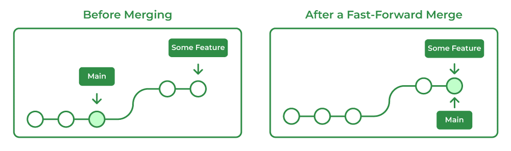
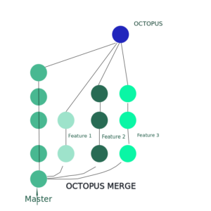

# Merge Approaches in Git

## Table of Contents
- [Merge Approaches in Git](#merge-approaches-in-git)
  - [Table of Contents](#table-of-contents)
  - [Overview](#overview)
  - [Merge Strategies](#merge-strategies)
     - [Fast-Forward Merge](#fast-forward-merge)
     - [Three-Way Merge](#three-way-merge)
     - [Recursive Merge](#recursive-merge)
     - [Octopus Merge](#octopus-merge)
     - [Squash Merge](#squash-merge)
     - [Ours Merge](#ours-merge)
     - [Subtree Merge](#subtree-merge)
  - [Conclusion](#conclusion)   
  - [References](#references)
## Overview
Merging in git allows multiple contributors to work on different branches of the same project, which helps to maintain an organized and independent development flow. Each branch is focused on a different aspect of the project, and eventually, they will be combined into the final form of the whole project. Git offers various merging strategies depending on the project's complexity and the branches' structure. This GitHub repository serves as a short guide for merging using both simple and also more complicated strategies.

## Merge Strategies
As explained above, the choice of strategy depends on the complexity of changes and the desired outcome. Let's dive into the most commonly used strategies:

### Fast-Forward Merge
The most used merge strategy is fast-forward merge that occurs during a merge operation when the base branch that's being merged into has no new commits since the feature branch was created or last updated. Git simply moves the pointer forward instead of creating a new "merge commit". The logic behind fast-forward merge is illustrated in [Figure 1](#FastForward).

```bash
git merge feature_branch
```

<figure id="FastForward" style="text-align: center;">
   <!-- Increased width -->
  <figcaption>Figure 1: Before and after a Fast-Forward Merge</figcaption>
</figure>
<p style="text-align: center;">
  Image source: <a href="https://www.geeksforgeeks.org/git-merge/" target="_blank">GeeksforGeeks</a>
</p>


### Three-Way Merge
Another simple strategy used when both the base branch and the feature branch have diverged (both have new commits since their last shared common ancestor) is the three-way merge. As the name suggests, Git uses three commits to generate the merge commit: the two branches and their common ancestor. Even though this strategy is different than the fast-forward one, the same command is used and Git automatically chooses the correct strategy based on the commit history. The concept of three-way merge is demonstrated in [Figure 2](#ThreeWayMerge).

```bash
git merge feature_branch
```
<figure id="ThreeWayMerge" style="text-align: center;">
   <!-- Increased width -->
  <figcaption>Figure 2: Before and after a Three-Way Merge</figcaption>
</figure>
<p style="text-align: center;">
  Image source: <a href="https://www.geeksforgeeks.org/git-merge/" target="_blank">GeeksforGeeks</a>
</p>


### Recursive Merge
This strategy is used for handling more complicated merges when branches have diverged, meaning that both the base and feature branches have unique commits. It creates a new merge commit to preserve the history of both branches similarly to the 3-way merge.

```bash
git merge --no-ff feature_branch
```

### Octopus Merge
Typically used for merging more than two branches at once. This is less common but often used for automated merges involving multiple feature branches. It is used in situations where you have several feature branches that you want to merge into a base branch without any need for individual merge commits for each one. If there are conflicts between branches that are being merged, the merge will fail. Look at [Figure 3](#OctopusMerge) for graphical illustration.

```bash
git merge -s octopus feature_branch1 feature_branch2 ...
```

<figure id="OctopusMerge" style="text-align: center;">
   <!-- Increased width -->
  <figcaption>Figure 3: Octopus Merge</figcaption>
</figure>
<p style="text-align: center;">
  Image source: <a href="https://www.geeksforgeeks.org/git-octopus-merge/" target="_blank">GeeksforGeeks</a>
</p>


### Squash Merge
Squashes all the commits from a feature branch into a single commit before merging into the target branch. This strategy simplifies the commit history, making it easier to follow. This is typically used for merging feature branch with many small commits for cleaner base branch history

```bash
git merge --squash feature_branch
```

### Ours Merge
When working with multiple branches, this strategy tells Git to ignore changes from all other branches. It creates a commit that represents the merge operation, but the final state of the merge is the same as the current branch's HEAD. It helps maintain a clear commit history, indicating that the branches were intended to be merged, even if the changes were ignored.

```bash
git merge -s ours feature_branch
```

### Subtree Merge
Subtree merge strategy is an extension of the recursive strategy. When merging A and B, if B is a child subtree of A, B is first updated to reflect the tree structure of A, This update is also done to the common ancestor tree that is shared between A and B.

```bash
git merge -s subtree branchA branchB
```

## Conclusion
Understanding which merging strategy to use for maintaining a clean and correct Git workflow is very important, because it can get confusing when working with multiple other contributors. Each strategy offers unique benefits and approaches depending on the specific context of the work. Identifying the correct merge strategy can simplify the process of combining code from many different branches and also ensure that the commit history is easy to understand for everyone. This guide aimed to explain how each strategy works and hopefully makes it clear on which strategy to use in different scenarios.

## References:
- [GeeksforGeeks: Merge Strategies in Git](https://www.geeksforgeeks.org/merge-strategies-in-git/)
- [Atlassian: Using Branches in Git](https://www.atlassian.com/git/tutorials/using-branches/merge-strategy)
- [Git SCM: Basic Branching and Merging](https://git-scm.com/book/en/v2/Git-Branching-Basic-Branching-and-Merging)
- [Medium: Git Merge Strategies](https://medium.com/@dmosyan/git-merge-strategies-options-that-you-dont-need-to-know-4d90223f38c3)
- [Working Software: Git Merge Strategies](https://www.workingsoftware.dev/which-git-merge-strategy-is-appropriate-for-our-team/)
