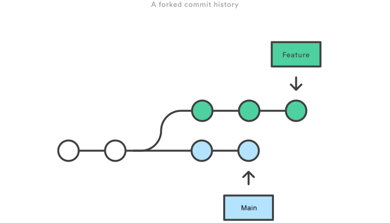

# Git Rebasing

## Overview

Git **rebase** is a powerful tool that allows you to move or reapply commits from one branch onto another. Unlike merging, which combines two branches while preserving their history, rebasing rewrites the commit history to create a linear sequence of commits. This can make your project history cleaner and easier to understand.

In this guide, we'll cover the basics of rebasing, how to use it in your workflow, a practical example, and the pros and cons of rebasing.

---

## Why Use Rebasing?

The primary reasons for using `git rebase` include:

1. **Clean and Linear History**: Rebasing allows you to maintain a more linear project history, without the noise of unnecessary merge commits.
2. **Better Context**: It ensures your feature branch's commits are based on the latest changes from the target branch, providing a clear context for changes.
3. **Avoiding Merge Conflicts**: Rebasing frequently helps reduce merge conflicts by keeping your branch up to date with the latest changes.

---

## Pros and Cons of Rebasing

### Pros:
- **Cleaner History**: Rebasing ensures a linear history by eliminating unnecessary merge commits, which makes the history easier to read and follow.
- **Simplifies Code Review**: With fewer merge commits, your changes are grouped in a straightforward manner, making the code review process simpler.
- **Works Well with Feature Branches**: Rebasing keeps all feature branches up to date without the need of multiple merges.

### Cons:
- **Risk of Data Loss**: Rebasing rewrites commit history, so there is a risk of losing commits if done incorrectly. This is especially dangerous if used on public/shared branches.
- **Potential Conflicts**: Rebasing can introduce more frequent conflicts since you are replaying all your commits on top of the latest changes.
- **Force Pushing Required**: After rebasing, you usually need to force-push (`git push --force-with-lease`), which can be risky if other developers are working on the same branch.

---

## Basic Git Rebase Workflow

<figure id="Rebase" style="text-align: center;">
  
  <figcaption>Figure 1: Fast-Forward merging</figcaption>
</figure>

  Image source: www.atlassian.com 

<https://www.atlassian.com/git/tutorials/merging-vs-rebasing>

